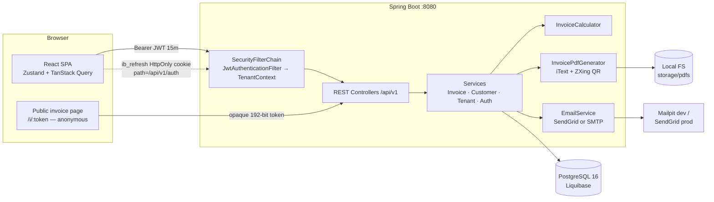
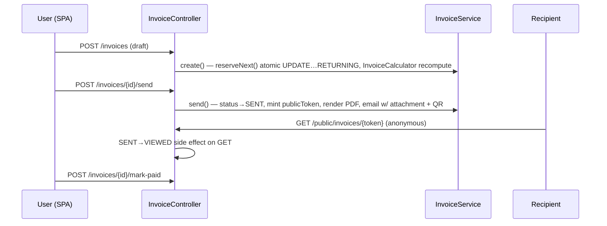

# Invoice Builder — Technical Analysis & Design Review

> Full-codebase review performed on 2026-07-08 (repo state: commit `eabe092`, Turn 12).
> Scope: all 46 backend Java files, all 40 frontend source files, Liquibase changelogs,
> CI workflows, Docker setup, and configuration.

---

## Table of Contents

1. [Executive Summary](#1-executive-summary)
2. [Architecture Overview](#2-architecture-overview)
3. [Module Breakdown](#3-module-breakdown)
4. [Current Features](#4-current-features)
5. [Strengths](#5-strengths)
6. [Weaknesses](#6-weaknesses)
7. [Technical Debt](#7-technical-debt)
8. [UX Problems](#8-ux-problems)
9. [Performance Opportunities](#9-performance-opportunities)
10. [Security Concerns](#10-security-concerns)
11. [Suggested New Features](#11-suggested-new-features)
12. [Priority Roadmap](#12-priority-roadmap)
13. [Recommended Refactoring](#13-recommended-refactoring)
14. [Long-term Vision](#14-long-term-vision)

---

## 1. Executive Summary

Invoice Builder is a **multi-tenant SaaS invoicing platform** (Spring Boot 3.4 / Java 21
backend + React 19 / Vite / TypeScript frontend) built incrementally over 12 commits
("Turns"). It is **not a drag-&-drop document editor** — despite the name, there is no
canvas, layout engine, undo/redo, or template designer. It is a classic CRUD + workflow
application: customers, invoices with line items, a server-side state machine
(DRAFT → SENT → VIEWED → PAID/OVERDUE/CANCELLED), server-rendered PDF (iText, two
hard-coded templates), email delivery (SendGrid/SMTP), and an anonymous public invoice
view with QR code.

**The foundations are unusually good for a young codebase**: correct multi-tenancy
discipline, hashed rotating refresh tokens, server-side money math in `BigDecimal`,
ProblemDetail error contract, i18n on both tiers, clean modular packaging.
**The biggest liabilities are**: zero tests on either tier, several "wired but dead"
features (roles never enforced, OVERDUE never triggered, send-dialog fields silently
discarded by the backend, the "modern" PDF template unreachable from the UI), and
infrastructure paid for but unused (Redis, WebSocket, rate limiting).

The highest-value next steps are not new surface area — they are **closing the five
integration gaps already latent in the code**, then building the dashboard, payments,
and recurring invoices on top of the existing patterns.

---

## 2. Architecture Overview

**Multi-tenancy model** — application-level row scoping. Every domain row carries
`tenant_id`; the JWT carries a `tid` claim;
[`JwtAuthenticationFilter`](../backend/src/main/java/com/invoicebuilder/auth/jwt/JwtAuthenticationFilter.java)
publishes it to a `ThreadLocal`
([`TenantContext`](../backend/src/main/java/com/invoicebuilder/tenant/TenantContext.java)),
and every repository query filters by it (`findByIdAndTenantId`, `search(tenantId, …)`).
Discipline is consistent across all services. There is **no Postgres RLS** — one
forgotten `AndTenantId` in a future query is a data leak; nothing structural prevents it.

**Auth flow** — 15-minute HS256 access token in memory (never persisted;
[`authStore.ts`](../frontend/src/store/authStore.ts)), plus a 7-day opaque refresh token,
SHA-256-hashed at rest
([`RefreshTokenService`](../backend/src/main/java/com/invoicebuilder/auth/RefreshTokenService.java)),
delivered as an `HttpOnly; Secure; SameSite=Lax` cookie path-scoped to `/api/v1/auth`.
The axios client ([`client.ts`](../frontend/src/api/client.ts)) does single-flight
refresh-on-401 with request replay, and boot-time silent refresh. OAuth2 (Google/GitHub)
auto-provisions a tenant per new identity and hands the SPA its access token via URL
fragment. This is a textbook-correct SPA auth design.

**Data flow for the core workflow** (create → send → view → paid):

**Folder structure & responsibilities**

| Module | Files | Responsibility |
|---|---|---|
| `backend …/auth` | 20 | JWT issue/parse, refresh rotation, OAuth2 provisioning, login/register |
| `backend …/tenant` | 8 | Tenant entity/settings, slug generation, ThreadLocal context |
| `backend …/customer` | 6 | CRUD + soft delete + fuzzy search |
| `backend …/invoice` | 15 | Entity + line items, state machine, calculator, atomic numbering, public view |
| `backend …/pdf`, `…/email`, `…/common`, `…/config` | 12 | PDF render/store, dual-backend email, envelopes/errors, security/clock config |
| `frontend src/api` + `hooks` | 6 | Axios client w/ refresh, typed API fns, TanStack Query wrappers |
| `frontend src/features` | 13 | Route-level pages per domain (auth, customers, invoices, public, dashboard) |
| `frontend src/components` | 9 | AppShell, Modal, PageHeader, route guards, 5 shadcn-style primitives |

State management is deliberately minimal and correct: **Zustand only for auth**,
**TanStack Query for all server state** (30s staleTime, key-family invalidation),
**react-hook-form + zod** for form state. There is no global app store, and none is
needed yet.

---

## 3. Module Breakdown

Key mechanics worth knowing:

- **Invoice numbering** —
  [`InvoiceNumberGenerator`](../backend/src/main/java/com/invoicebuilder/invoice/InvoiceNumberGenerator.java)
  uses native `UPDATE tenant SET next_invoice_number = next_invoice_number + 1 … RETURNING`,
  so concurrent creates can't collide. Format `INV-2026-0042`. Two quirks: it uses
  `LocalDate.now()` instead of the injected `Clock` (breaks test-time control the rest of
  the codebase carefully preserves), and the counter never resets at year boundary despite
  the year appearing in the number.
- **Money math** —
  [`InvoiceCalculator`](../backend/src/main/java/com/invoicebuilder/invoice/InvoiceCalculator.java)
  recomputes everything server-side ("tamper-proof totals"): per-line
  `qty×price −discount% → +tax%`, then flat invoice discount, clamped at zero, HALF_UP at
  scale 2. The frontend mirrors this in floating point
  ([`InvoiceFormPage.tsx:321-336`](../frontend/src/features/invoices/InvoiceFormPage.tsx))
  for the live totals panel — display-only, so drift is cosmetic, but it is duplicated
  business logic that can disagree with the authoritative number.
- **State machine** —
  [`InvoiceStatus`](../backend/src/main/java/com/invoicebuilder/invoice/InvoiceStatus.java)
  encodes the transition table in the enum with `requireTransition()`. Editability = DRAFT
  only; PAID/CANCELLED terminal. Clean and single-sourced; the frontend re-derives button
  visibility from status strings
  ([`InvoiceDetailPage.tsx:54-56`](../frontend/src/features/invoices/InvoiceDetailPage.tsx)).
- **PDF** —
  [`InvoicePdfGenerator`](../backend/src/main/java/com/invoicebuilder/pdf/InvoicePdfGenerator.java)
  renders A4 via iText with two branch-level "templates" (`classic`/`modern` differ in
  header band, zebra striping, accent color), localized labels from
  `messages*.properties`, locale-aware currency/date formatting, and a ZXing QR pointing
  at the public view URL. PDFs are regenerated on every preview/download/send and also
  written to disk — but `invoice.pdf_path` is never populated and `PdfStorage.load` is
  never called, so the disk cache is write-only dead weight.
- **Email** —
  [`EmailService`](../backend/src/main/java/com/invoicebuilder/email/EmailService.java)
  picks SendGrid vs SMTP at runtime by presence of the API key; identical contract, PDF
  attached. Sending is **synchronous inside the `send()` transaction** — a slow SendGrid
  call holds a DB transaction open, and a failure after `status=SENT` rolls everything
  back together (at least consistent), but retry semantics are "user clicks again".
- **Public view** —
  [`PublicInvoiceController`](../backend/src/main/java/com/invoicebuilder/invoice/PublicInvoiceController.java)
  resolves a 192-bit URL-safe token, and **mutates SENT→VIEWED on a GET**. Email
  link-prefetchers and antivirus scanners routinely fetch links, so "Viewed" will fire
  false positives; a GET that writes is also an idempotency smell.
- **Frontend list rendering** — the invoice list joins customer names **client-side** by
  fetching up to 200 customers and `find()`-ing per row
  ([`InvoiceListPage.tsx:38,132`](../frontend/src/features/invoices/InvoiceListPage.tsx)),
  because
  [`InvoiceListItem`](../backend/src/main/java/com/invoicebuilder/invoice/dto/InvoiceListItem.java)
  carries only `customerId`. Same 200-cap dropdown pattern in the invoice form. Breaks at
  tenant #201's customer.

---

## 4. Current Features

| Feature | Workflow & components | Validation / rules | Edge cases & limitations |
|---|---|---|---|
| **Register / Login** | [`RegisterPage`](../frontend/src/features/auth/RegisterPage.tsx) → `AuthService.register` creates tenant + OWNER user, issues tokens | zod client-side; Bean Validation server-side; bcrypt(12); email lowercased | No email verification, no password reset, no password-strength rule beyond client |
| **OAuth2 (Google/GitHub)** | Login buttons → backend authorize → [`CustomOAuth2UserService`](../backend/src/main/java/com/invoicebuilder/auth/oauth2/CustomOAuth2UserService.java) auto-provisions tenant → fragment-token handoff → [`OAuth2CallbackPage`](../frontend/src/features/auth/OAuth2CallbackPage.tsx) | Rejects providers without email; refuses cross-provider email takeover | Config-gated (boots clean without creds). No account-linking UI |
| **Session persistence** | Silent refresh on boot; single-flight 401 retry | Token rotation on every refresh | No refresh-token *reuse detection* (a stolen-then-reused token doesn't revoke the family) |
| **Customer CRUD** | List w/ 300ms-debounced search, form w/ address block; soft delete | zod ↔ server `@Valid` aligned; soft-deleted excluded everywhere | Deleting customer with open invoices leaves detail pages showing "—"; no undelete UI |
| **Create/Edit invoice** | [`InvoiceFormPage`](../frontend/src/features/invoices/InvoiceFormPage.tsx): customer select, dates, currency, dynamic line-item rows (`useFieldArray`), live totals | ≥1 line item; tax/discount ≤100; DRAFT-only editing enforced server-side (409) | **No template picker** — `template` exists in payload type & backend but the form never sends it, so "modern" PDF is dead UI-side. No dueDate ≥ issueDate check on either tier. Full replace of line items on update |
| **Delete invoice** | DRAFT-only, `window.confirm` | 409 otherwise | Hard delete (no archive) |
| **Send invoice** | [`SendInvoiceDialog`](../frontend/src/features/invoices/SendInvoiceDialog.tsx): recipient/subject/message → POST `/send` | DRAFT→SENT via state machine; publicToken minted; localized default subject/body | **Backend ignores the dialog's payload** (no `@RequestBody` in [`InvoiceController.java:84-88`](../backend/src/main/java/com/invoicebuilder/invoice/InvoiceController.java)); silently skips email if customer has none; no resend/reminder for non-DRAFT |
| **PDF preview / download** | [`InvoicePreviewDialog`](../frontend/src/features/invoices/InvoicePreviewDialog.tsx) iframe blob + download | Regenerated fresh each time | No public-recipient PDF download; blob URL approach loses browser PDF UX niceties |
| **Public invoice view** | `/i/:token` anonymous page, full read-only render | SENT→VIEWED on first view | GET-mutation false positives (scanners); no "Pay now"; no PDF button |
| **Mark paid / Cancel** | Detail-page buttons per status | Transition table; `amountPaid = total` on paid | No partial payments despite `amount_paid` column supporting it |
| **List + filters** | Status/customer/date filters, pagination, `keepPreviousData` | — | No sorting UI, no search by number, no bulk actions |
| **i18n** | en/de/fr on SPA ([`i18n/index.ts`](../frontend/src/i18n/index.ts)), PDF, and email | Locale detector + localStorage | Tenant `defaultLocale` and user `locale` exist in DB but don't drive the SPA language |
| **Tenant settings** | Backend GET/PUT `/api/v1/tenant` complete | — | **No UI** — Settings route is a "Coming in Phase 2" placeholder ([`router.tsx:131`](../frontend/src/router.tsx)); invoice prefix, address, tax id, logo are uneditable in-app |
| **Dashboard** | Greeting only ([`DashboardPage.tsx`](../frontend/src/features/dashboard/DashboardPage.tsx)) — even prints the raw tenant UUID | — | No metrics, no receivables, no recent activity |

Features that **do not exist at all**: drag & drop, resize/move, copy/paste, undo/redo,
history, keyboard shortcuts, auto-save, template management/designer, dynamic
fields/variables, conditional rendering, permissions enforcement, feature flags,
Storybook, tests.

---

## 5. Strengths

1. **Tenant isolation discipline** — every query audited scopes by tenant; ThreadLocal
   cleanup in `finally` prevents pooled-thread leakage.
2. **Security posture above average for the stage** — hashed rotating refresh tokens,
   in-memory access token, path-scoped cookie, server-side recompute of all money,
   opaque 192-bit public tokens, ProblemDetail without stack traces, secrets via env vars.
3. **Clean layering & small files** — controllers are thin, services own logic, DTO
   records everywhere, no entity ever serialized to the wire.
4. **Injected `Clock` everywhere** (except one spot) — a testability investment most
   codebases skip.
5. **State machine in the enum** — one source of truth for lifecycle rules with real
   409 semantics.
6. **Modern, consistent frontend stack** — server state via TanStack Query with correct
   invalidation; zod schemas mirroring server validation; lazy-loaded routes; i18n from
   day one.
7. **Solid dev-infra ergonomics** — Makefile, Docker Compose with health checks, port
   choices respecting local conflicts, Swagger, Liquibase from the start, CI with GHCR
   image publishing.

---

## 6. Weaknesses

1. **Zero tests** — no `backend/src/test` at all; frontend has only the Vitest setup
   file. CI's frontend test step is `continue-on-error: true`; backend `check` passes
   vacuously. For code with money math, a state machine, and token rotation, this is the
   single largest risk. The infrastructure (Testcontainers, REST Assured, Testing
   Library, `application-test.yml`) is already configured — only the tests are missing.
2. **Five silent feature gaps** (details in §7): send-dialog payload dropped, modern
   template unreachable, OVERDUE never fires, roles never enforced, tenant settings UI
   missing.
3. **Client-side joins and 200-row caps** for customer names/dropdowns — a data-shape
   problem (`InvoiceListItem` lacks `customerName`) fixed most cheaply on the backend.
4. **Duplicated totals logic** in float on the client vs BigDecimal on the server.
5. **No error boundary, no 404 page** (unknown routes silently redirect to `/`),
   `window.confirm` for destructive actions, dead code (`onSent={() => void 0}`).
6. **UTC date bugs at the edge** — [`format.ts`](../frontend/src/lib/format.ts)
   `todayIso()` uses `toISOString()`, so users west of UTC get tomorrow's issue date in
   the evening.

---

## 7. Technical Debt

| # | Debt item | Evidence | Cost of ignoring |
|---|---|---|---|
| 1 | `/send` ignores request body | [`InvoiceController.java:86`](../backend/src/main/java/com/invoicebuilder/invoice/InvoiceController.java) vs [`invoices.ts:99`](../frontend/src/api/invoices.ts) | Users' custom recipient/subject/message silently vanish — trust-destroying bug |
| 2 | Roles modeled, never enforced | `Role` in JWT + `@EnableMethodSecurity`, but zero `@PreAuthorize` anywhere | "Multi-user tenant" is an illusion; MEMBER = OWNER |
| 3 | OVERDUE sweep never scheduled | `markOverdueForTenant` + `findOverdueIds` exist; no `@Scheduled` in repo | Status/filters/badge for OVERDUE are dead UI |
| 4 | Unused infra: Redis, bucket4j, WebSocket/STOMP starters (backend); `@stomp/stompjs`, `sockjs-client`, query-devtools (frontend) | grep: zero usages; compose + CI still run Redis | Slower builds, misleading README, `app.rate-limit` config lies |
| 5 | Schema-only tables: `audit_log`, `notification`, `currency_rate` | changelogs 0006–0008; no entities | Migrations drift from reality; onboarding confusion |
| 6 | `invoice.pdf_path` never written; `PdfStorage.load` never called | grep confirmed | Dead column + write-only disk usage growing unbounded, incl. committed PDFs under `backend/storage/` (should be gitignored) |
| 7 | Template field end-to-end dead from UI | No template control in [`InvoiceFormPage.tsx`](../frontend/src/features/invoices/InvoiceFormPage.tsx) | Half of the PDF work (Turn 10) unreachable |
| 8 | GET mutates state on public view | [`PublicInvoiceController.java:57-61`](../backend/src/main/java/com/invoicebuilder/invoice/PublicInvoiceController.java) | False "Viewed" from mail scanners; breaks HTTP semantics |
| 9 | `InvoiceNumberGenerator` bypasses `Clock`; year not part of uniqueness | [`InvoiceNumberGenerator.java:53`](../backend/src/main/java/com/invoicebuilder/invoice/InvoiceNumberGenerator.java) | Untestable year rollover; `INV-2027-4213` continues 2026's counter |
| 10 | Duplicate cookie-writing code | AuthController + OAuth2SuccessHandler both hand-format `Set-Cookie` | Divergence risk (e.g., one gains `Secure` conditionals, other doesn't) |

---

## 8. UX Problems

1. **Send dialog betrays the user** (debt #1) — worst offender because it *looks* like
   it worked.
2. **Dashboard is a dead end** — first screen after login shows a raw tenant UUID and no
   data; the natural "what am I owed?" question is unanswered.
3. **Settings nav item leads to a placeholder** — users cannot set company
   address/tax-id/prefix, so their PDFs render half-empty headers with no explanation.
4. **No path from PAID-adjacent reality**: no partial payment, no resend, no reminder,
   no duplicate-invoice; a voided-then-redo flow requires manual re-entry of every line.
5. **Customer pickers are `<select>`s capped at 200** — unusable beyond a small book of
   business; no inline "create customer" from the invoice form (forces a context switch
   that loses the draft).
6. **`window.confirm` deletes** — jarringly non-native next to the polished Modal; no
   undo/toast-action.
7. **No dueDate ≥ issueDate validation** — you can issue an invoice already
   overdue-by-construction.
8. **Public page**: recipient can't download a PDF and there's no payment CTA — the two
   things a recipient actually wants to do.
9. **No keyboard affordances** in the line-item grid (Enter to add row, etc.) — the
   highest-frequency editing surface in the app.
10. Language switcher is per-browser only; a French tenant's registered locale doesn't
    follow them to a new device.

---

## 9. Performance Opportunities

Current scale makes nothing urgent; ordered by when they'll bite:

1. **PDF regenerated on every preview/download/send** — iText render per click,
   synchronous in request threads. Cache by `(invoiceId, updatedAt)` using the
   already-existing `pdf_path` column, or move render off-thread. (Also fixes debt #6.)
2. **Client-side customer join** — add `customerName` to `InvoiceListItem` via a
   projection join; drop the extra query entirely.
3. **Email inside the transaction** — move to
   `@TransactionalEventListener(AFTER_COMMIT)` + async executor; unblocks send latency
   (SendGrid p99 can be seconds) and enables retries.
4. `search` JPQL with `:param is null or …` chains defeats index selectivity as data
   grows — fine now; move to Specifications when adding sorting/full-text.
5. Frontend: routes are already lazy-loaded; no memoization problems worth touching
   (the TotalsPanel `useWatch` correctly isolates re-renders away from the field rows).
   Bundle: removing the three unused deps (stomp, sockjs, devtools) is free weight loss.
6. `useCustomerList({size:200})` runs on both list and form mounts with the same key —
   Query dedupes it; fine.

---

## 10. Security Concerns

Ordered by severity:

1. **No authorization layer beyond authentication** (debt #2). Any authenticated MEMBER
   can update tenant settings, cancel invoices, delete customers. Add
   `@PreAuthorize("hasRole('OWNER')")`-style guards on tenant mutation + invoice state
   actions.
2. **No rate limiting despite config promising it** — login brute-force and public-token
   scanning are unthrottled (bucket4j + Redis are already on the classpath;
   `RATE_LIMIT_EXCEEDED` error code already defined).
3. **No refresh-token reuse detection** — rotation exists, but a replayed old token just
   401s without revoking the user's session family. Cheap add in
   [`RefreshTokenService.rotate`](../backend/src/main/java/com/invoicebuilder/auth/RefreshTokenService.java):
   on reuse of a revoked token, `revokeAllForUser`.
4. **Access token in URL fragment during OAuth2 handoff** — acceptable pattern, but the
   token transits browser history until `history.replaceState` runs; consider one-time
   code exchange later.
5. **Public endpoint enumeration hygiene** — 192-bit tokens are unguessable, but there's
   no per-IP throttle. Low risk, cheap fix alongside #2.
6. **No email verification** on registration — combined with #1, anyone can register and
   immediately send emails "from" the platform (spam vector via SendGrid).
7. Committed real PDFs under `backend/storage/pdfs/` — likely test artifacts; should be
   gitignored and purged.
8. Non-issues worth recording: CSRF is fine (cookie path-scoped to auth endpoints, API
   is Bearer-only); SQL injection is fine (parameterized everywhere); totals tampering
   is fine (server recompute).

---

## 11. Suggested New Features

Competitive context: against Invoice Ninja / Zoho Invoice / Stripe Invoicing /
QuickBooks, the table-stakes gaps are **online payment collection, recurring invoices,
reminders/dunning, dashboard/reports, estimates→invoice conversion, product catalog,
taxes per region, and multi-user roles**. Against document editors (Canva/Word), the gap
is the whole "builder" concept — custom branding, logo, layout — of which only the DB
columns (`logo_path`, `template`) exist today. Do *not* chase canvas-style editing; the
winning wedge for this codebase is workflow + payments, with branding-level (not
layout-level) customization.

### High impact (close gaps, then table stakes)

- **H1. Fix the five dead wires** — send payload (`@RequestBody` + tests), template
  picker in form + preview toggle, `@Scheduled` overdue sweep (iterate tenants; the
  per-tenant method already exists), role enforcement, Settings page (backend is done —
  pure frontend work).
- **H2. Dashboard with receivables** — outstanding / overdue / paid-this-month tiles +
  recent activity; one aggregate query endpoint.
- **H3. Online payments** — "Pay now" (Stripe Checkout) on the public page; webhook →
  `markPaid` (partial-payment support via existing `amount_paid`).
- **H4. Automatic reminders / dunning** — builds directly on the overdue sweep +
  EmailService; per-tenant cadence config.
- **H5. Duplicate invoice & credit-note/void flow** — cheap (copy constructor over
  existing DTOs), huge daily-use value.

### Medium impact (productivity)

- **M1.** `customerName` in list DTO + searchable async customer combobox (kills the
  200-cap).
- **M2.** Product/service catalog with price memory → line-item autocomplete.
- **M3.** Estimates/quotes sharing the invoice machinery (new status branch, convert
  action).
- **M4.** Recipient PDF download + logo upload (storage config + `logo_path` already
  exist) + accent-color pick — "branding-lite" instead of a layout editor.
- **M5.** CSV/Excel export of the filtered invoice list; import of customers.
- **M6.** Email verification + password reset (auth completeness).

### Advanced / enterprise

- **A1.** Audit trail — the `audit_log` table already exists; populate via service-layer
  events; render a timeline on the detail page.
- **A2.** Multi-user tenants: invite flow + role management UI (depends on H1-roles).
- **A3.** Multi-currency with rate snapshots — `currency_rate` table exists; snapshot
  rate on send.
- **A4.** In-app notifications — `notification` table exists; only now does the
  WebSocket dependency earn its keep.
- **A5.** Postgres RLS as defense-in-depth under the existing TenantContext.

### AI features (ordered by fit to existing architecture)

- **AI1. Natural-language invoice draft** — "Invoice Acme for 12h consulting at €90 plus
  the usual hosting fee" → prefilled `InvoiceRequest`; pure server-side function-calling
  endpoint, low UI risk.
- **AI2. Line-item autocomplete/categorization** from the tenant's history.
- **AI3. Dunning-email copywriting** — tone-adjusted reminder text (feeds H4).
- **AI4. Receipt/PO OCR → invoice** — heavier; needs upload infra first.
- **AI5. Translation of notes/terms** per recipient locale — the i18n scaffolding makes
  this natural.

### Collaboration & power-user

- Comments on invoices (internal notes vs customer-visible), version history (falls out
  of A1's audit events), command palette (route+action registry is small enough today
  that this is a weekend feature), keyboard shortcuts in the line-item grid, saved
  invoice defaults ("terms templates" per tenant).

---

## 12. Priority Roadmap

| Phase | Item | Biz value | User value | Effort | Risk | Depends on |
|---|---|---|---|---|---|---|
| **0 — Trust** (do first) | Test suite: calculator, state machine, numbering, refresh rotation, tenant isolation (Testcontainers); flip CI to enforcing | ★★★ | — | M | none | — |
| 0 | H1 dead-wire fixes (5 items) | ★★★ | ★★★ | S each | low | tests |
| 0 | Security quick wins: rate limit login+public, reuse detection, gitignore storage | ★★★ | ★ | S | low | — |
| **1 — Daily usability** | Settings page, M1 list join + combobox, H5 duplicate/void, dueDate validation, error boundary + 404 | ★★ | ★★★ | S–M | low | — |
| 1 | H2 dashboard | ★★★ | ★★★ | M | low | — |
| **2 — Revenue loop** | H3 Stripe payments | ★★★ | ★★★ | L | webhook correctness | H1-overdue, tests |
| 2 | H4 reminders/dunning | ★★★ | ★★ | M | email deliverability | H1-overdue |
| 2 | M4 branding-lite, M6 auth completeness | ★★ | ★★ | M | low | Settings |
| **3 — Expansion** | M2 catalog, M3 estimates, M5 import/export | ★★ | ★★ | M–L | low | Phase 1 |
| 3 | A1 audit trail, A2 multi-user | ★★ (enterprise) | ★ | L | low | roles |
| 4 | AI1–AI3, A3 multi-currency, A4 notifications | differentiation | ★★ | L–XL | model/API cost | Phases 1–2 |

Effort scale: S < 1 day · M = days · L = 1–2 weeks · XL > 2 weeks.

---

## 13. Recommended Refactoring

Smallest set with highest leverage:

1. **Extract a `CookieFactory`/helper** shared by AuthController and
   OAuth2SuccessHandler (debt #10) — S.
2. **`InvoiceListItem` + repository projection with `customerName`** — S; deletes the
   client join and both 200-caps' worst symptom.
3. **Async email via domain event after commit** — M; prerequisite for
   reminders/dunning retries.
4. **PDF cache keyed on `updatedAt`** using the existing `pdf_path` — S; or delete the
   column and `PdfStorage.load` if you'd rather stay stateless (either way, stop the
   write-only growth).
5. **Change public view to POST-view-beacon or signed-pixel** for VIEWED, keeping GET
   pure — S.
6. **Single-source client totals**: extract the totals function into a tested `lib/`
   module documented as display-only, or return computed totals from a dry-run
   endpoint — S.
7. **Remove unused dependencies** (backend: websocket/redis/bucket4j starters *if* you
   don't take the rate-limit path — otherwise keep bucket4j+redis and use them;
   frontend: stomp/sockjs/devtools) and either delete changelogs' unused tables or
   annotate them as forward-schema — S.
8. Defer: repository Specifications, RLS, S3 storage — until the features that need them
   arrive. Do **not** introduce new architecture (modulith events, CQRS,
   micro-frontends); the current shape is right for the team size the git history
   implies.

---

## 14. Long-term Vision

The codebase is 12 turns into a deliberate phased plan (comments reference Phases 6–7:
scheduled jobs, S3), and its bones — per-tenant scoping, a state machine, localized
rendering, dual-mode email — are exactly the chassis of a **small-business billing
platform**, not a document editor. The strategic sequence:

1. **Make what exists honest** — tests + the five dead wires.
2. **Close the money loop** — payments + reminders; the point where the product earns
   subscription revenue.
3. **Widen the funnel** — estimates, catalog, imports.
4. **Go multi-user/enterprise** — roles UI, audit, notifications; the tables are already
   waiting.

AI drafting and dunning copy form the differentiation layer on top. The "builder"
ambition in the name is best satisfied with branding-level customization (logo, colors,
a template gallery grown from the two existing iText templates) rather than a canvas
editor, which would be a rewrite-scale detour away from this architecture's strengths.

---

### Open questions (not verifiable from source)

- Whether OAuth2 credentials / SendGrid keys are configured in any real environment.
- Whether the GHCR deploy target is live.
- The README references a `docs/` folder for "Architecture and API spec" — this document
  is its first content.
